# CarND Behavioral Cloning Project
My solution of the Udacity Self-Driving Car Engineer Nanodegree Semantic Segmentation project (second project of term 3).
<br> The goal was to implement the **[Fully Convolutional Network (FCN)](https://arxiv.org/abs/1411.4038)** semantic 
segmentation network and then train the model to segment road pixels.
<br>[Official project's repo from Udacity](https://github.com/udacity/CarND-Semantic-Segmentation)

## 1. Installation
Clone this GitHub repository and install the dependencies through pip.
```
$ git clone https://github.com/AndreaIncertiDelmonte/CarND-Semantic-Segmentation-Project.git
$ cd CarND-Semantic-Segmentation-Project
$ pip install -r requirements.txt
```

### 1.1 Project software dependencies
```
Python 3
jupyter
ipykernel
tensorflow-gpu==1.6.0
scipy
tqdm
Pillow
```
### 1.2 Project hardware requirements
In order to train the FCN model an NVIDIA GPU is required. 

## 2. FCN-8
FCN-8 like other semantic segmentation networks is composed by two main parts: the **encoder** and the **decoder**. 
The first component is able to extract meaningful features from raw images while the latter can produce a pixel 
level segmentations at the same resolution of the input image.
FCN-8 can also be trained end-to-end so both the feature extraction and upsampling are learned from data. 

### 2.1 FCN-8 Schema from the original paper
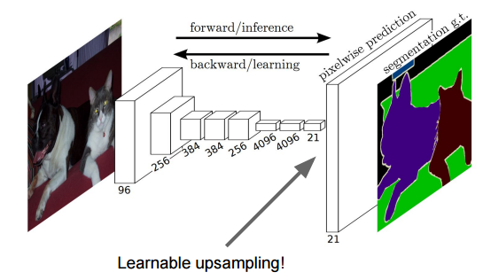

### 2.2 Skip connections
In order to recover spatial relationships in the upsampling phase, FCN-8's authors adopted two skip connections that 
connects encoder's *pool3* and *pool4* layers with the decoder.


### 2.3 VGG16 encoder
The [VGG16](https://arxiv.org/abs/1409.1556) CNN has been chosen for the **encoder** part of FCN-8. Udacity provided 
a [model](https://s3-us-west-1.amazonaws.com/udacity-selfdrivingcar/vgg.zip) already trained on ImageNet. 
The model also is not vanilla VGG16, but a fully convolutional version, which already contains the 1x1 convolutions to 
replace the fully connected layers. 

#### 2.3.1 VGG16 Schema from the original paper
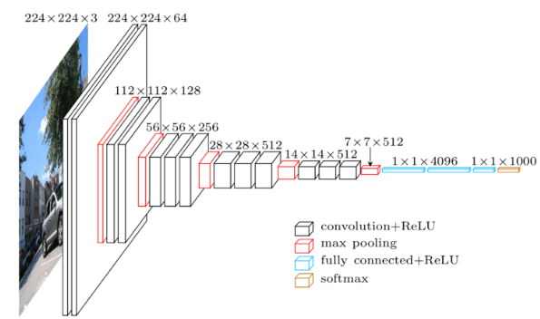

### 2.4 Decoder implementation
The following layers have been added to VGG16 to compose the decoder:
* **layer3_out_scaled** Scaled version (0.0001) of *layer3_out (pool3)*
* **layer3_out_1x1** 1x1 convolutional layer after *layer3_out_scaled*
* **layer4_out_scaled** Scaled version (0.01) of *layer4_out (pool4)*
* **layer4_out_1x1** 1x1 convolutional layer after *layer4_out_scaled*
* **layer7_out_1x1** 1x1 convolutional layer after *layer7_out*
* **layer7_out_deconv_2x2** Deconvolutional layer applied on *layer7_out_1x1* (kernel (4,4) and stride (2,2))
* **skip1** Skip connection layer that sums *layer7_out_deconv_2x2* and *layer4_out_1x1*
* **skip1_deconv_2x2** Deconvolutional layer applied on *skip1* (kernel (4,4) and stride (2,2))
* **skip2** Skip connection layer that sums *skip1_deconv_2x2* and *layer3_out_1x1*
* **skip2_deconv_8x8** Deconvolutional layer applied on *skip2* (kernel (16,16) and stride (8,8)).

The added *convolutionale (conv2d)* and *deconvolutional (conv2d_transpose)* layers have been initialized with the truncated_normal_initializer and standard 
deviation of 0.001 and 0.01 respectively. Also on these layers it has been applied an L2 regularizer with standard deviation of 0.01.

## 3. Loss and Optimization
The final loss is composed by:
* Cross entropy loss 
* L2 regularization loss.

Adam as been used as optimizer with 0.00001 of learning rate and 0.5 of dropout probability.

## 4. Training
The model was trained on the [Kitty dataset](http://www.cvlibs.net/datasets/kitti/) downloaded from 
[here](http://www.cvlibs.net/download.php?file=data_road.zip). Different combinations of batch sizes (5, 10 and 15) 
and different epochs (10, 20, 50 and 100) has been tried.

### 4.1 Training loss evolution
The following graphs show the cross entropy loss evolution with different batches sizes through different epochs.
Increasing the batch size will reduce the overfitting but also it will make the loss decreasing more slowly.

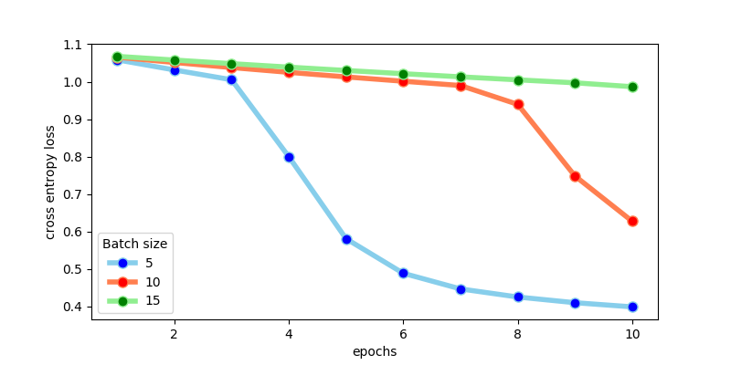

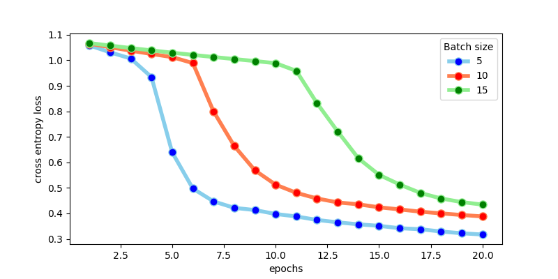

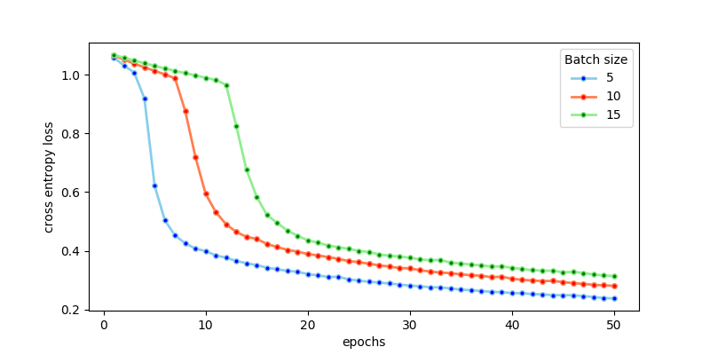

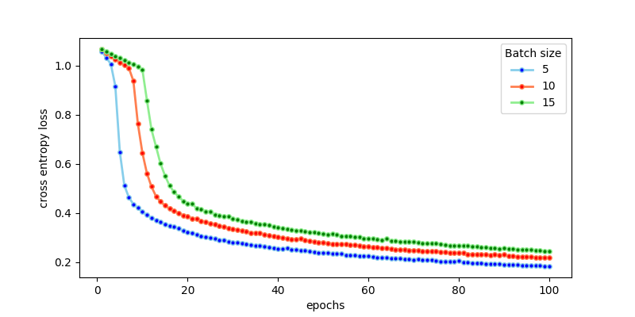

## 4. Test data evaluation
Here some examples that show how segmentation improves increasing the training epochs.
### 10 Epochs
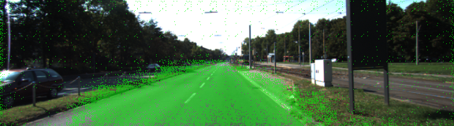
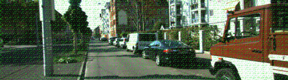
### 20 Epochs
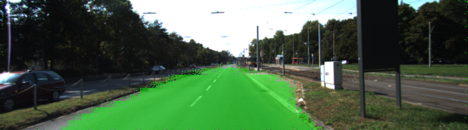
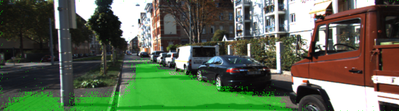
### 50 Epochs
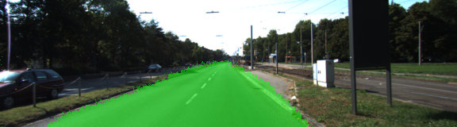
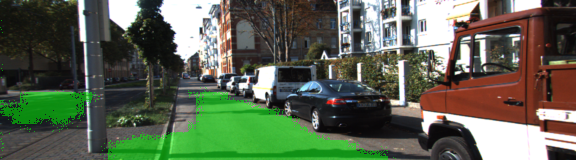
### 100 Epochs
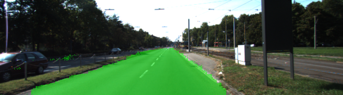
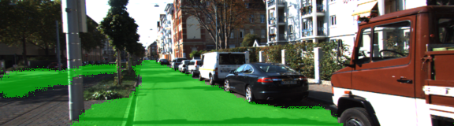

## 5. Discussion
The current version of the system can be improved by working on the following aspects:
* **Data augmentation** generating more training data by applying transformations on the original images like vertical 
flip or brightness adjustment. 
* **[CRF - Conditional Random Field](https://en.wikipedia.org/wiki/Conditional_random_field)** a statistical modeling 
method that can be applied to refine CNN output.
